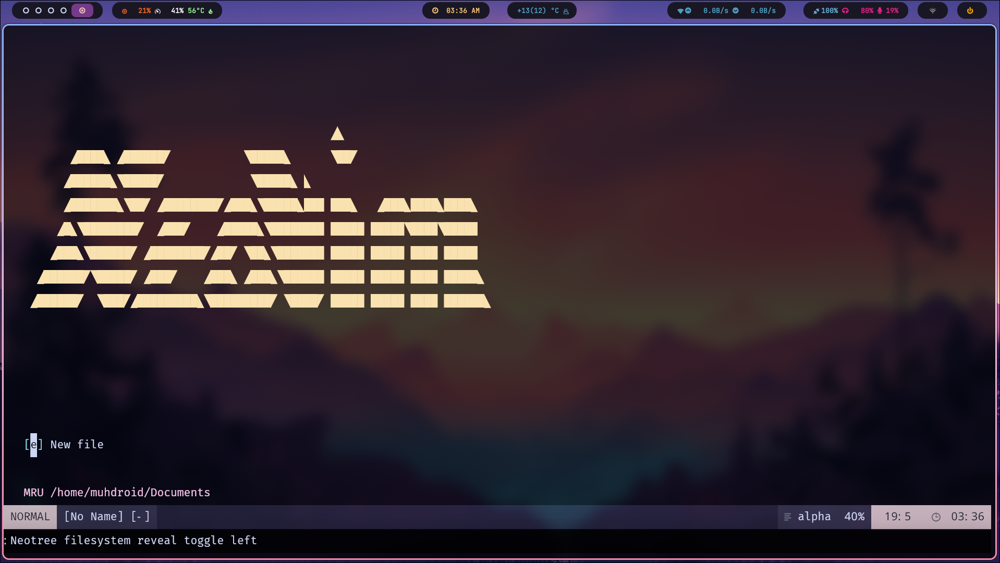
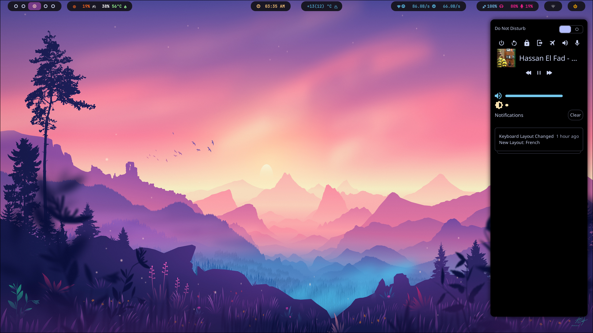
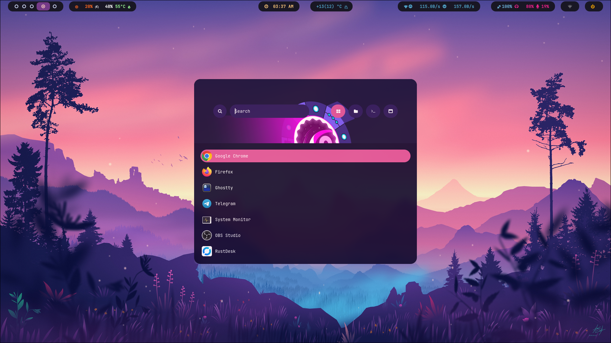
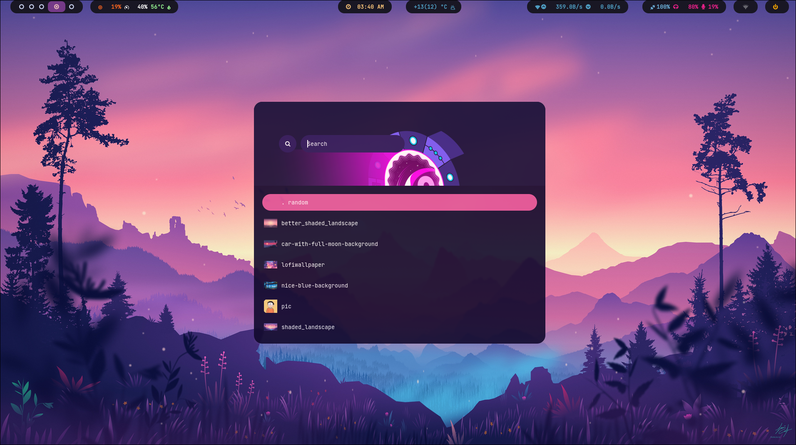

# MuhZero Dotfiles

These are my personal dotfiles for various applications, with a focus on my Hyprland and Neovim configurations.

## Screenshots

### Neovim Configuration



### Waybar Configuration



### Rofi Configuration



### Wallpapers



## What’s Included

- **Hyprland**: Custom configuration for Hyprland, a dynamic Wayland compositor.
- **Neovim**: My Neovim configuration for a smooth coding experience with plugins and custom mappings.
- **Neovide**: Custom settings for Neovide, a graphical frontend for Neovim.
- **Swaync**: Configuration for notifications in Sway.
- **Waybar**: Custom status bar for Wayland.
- **Wlogout**: Simple Wayland logout utility.
- **Alacritty**: Lightweight terminal emulator with custom configurations.

## Installation

To use these dotfiles, clone this repository to your machine and create symbolic links for the relevant config files.

### Step 1: Clone the repository

```bash
git clone https://github.com/your-username/dotfiles.git ~/.dotfiles
cd ~/.dotfiles

